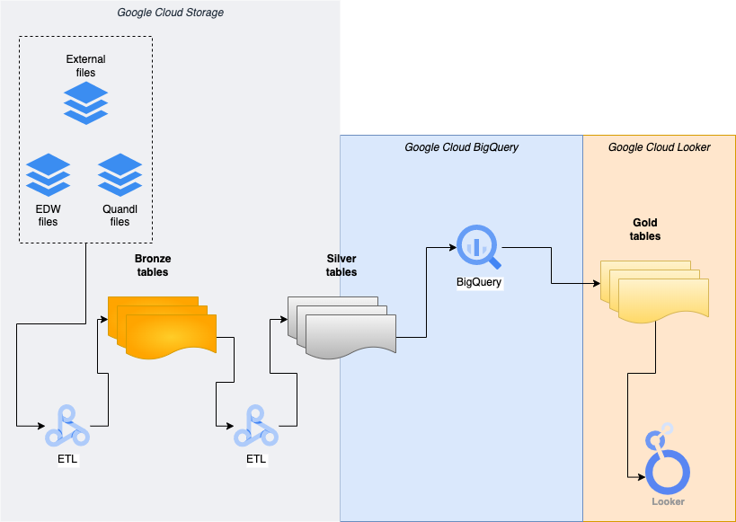

# Loan Data Exploration

This repository hosts the ETL that creates the Algoritmica data lakehouse.

The data is located on GCS inside a bucket where raw data from external providers (ex: EDW, Quandl, etc) is safely stored for processing.

The Lakehouse architecture has been chosen to leverage the advantages of the data lake and data warehouse architecture.

## Schema



## Main design

By leveraging GCP Dataproc Serverless, the original data from EDW is processed as following:

- **Bronze layer**: one-to-one copy of the raw file, profiled with a lower level of rules and enhanced with new columns to support Slow Changign Dimension Type 2.
- **Silver layer**: normalized data from the previous layer where dimensions are separated and data is prepared for BI queries and/or ML feature preparation.
- **Gold layer**: enhanced data for business index metrics or features ready to be feed into ML model factory.

The **Bronze** and **Silver** layers are manipulated via Dataproc Serverless for Apache Spark. The **Gold** one can be processed differently according to the usage:

- For BI metrics generation (a.k.a. indexes), _Looker Studio_ is used to prepare dashboards and plots.
- For ML feature engineering, _Dataproc Serverless_ or _DataFlow_ is used to elaborate futher the data.

Two stages of data profiling are applied to the ETL. These are divided into:

- **bronze level profiling**: set of rules that check basic data quality for the EDW raw data before storing the files in the _Bronze layer_. Some examples are: primary key columns are unique and complete, tables are not empty, columns that should not hold **NULL** values are correct and minimum set of compulsory columns are not missing.
- **silver level profiling**: set of rules that check quality of _Silver layer_ tables before allowing them to be processed in the _Gold layer_. Depending on the asset class and file type, these rules can be very heterogenous.

## Data assumptions

Most of the assumptions are explored via the notebooks hosted in `experiments`.

For `assets` the primary key column is a combination of the _ed code_
(extracted from the file name) and the column AS3.

For `collateral` the primary colum is a combination of the _ed code_ and the column CS1.

For `bond info` the primary colum is a combination of the _ed code_ and the column BS1 and BS2.

For `amortisation` the primary colum is a combination of the _ed code_ and the column AS3.

## How to run the project

Clone the repository onto a local machine and make sure that `gcloud cli` is installed and prepared to be used. It is required to have credentials set up to access the `dataops-369610` project on GCP.

The `Makefile` should be edited accordingly in case the data to process is allocated to another bucket/folder.

Run the following command to prepare the code and uploa it onto GCP:

```bash
> make setup && make build
```

To profile the bronze tables run the following command:

```bash
> make -j3 all_bronze_profile
```

To build the bronze tables run the following command:

```bash
> make -j4 all_bronze
```

To build the silver tables run the following command:

```bash
> make -j4 all_silver
```

To build the Quandl dataset run the following command:

```bash
> make run_quandl_silver
```

User the `GNU screen` utility to detach a session and continue to work on the terminal.
